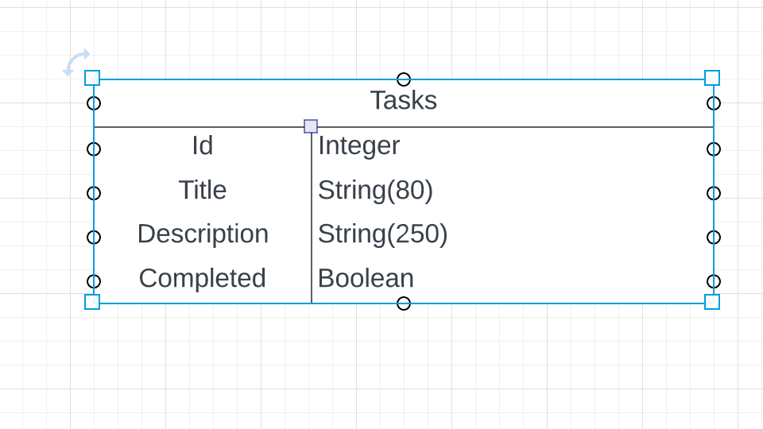

# ToDo app :

## Summary :
I chose to do a simple todo app in an effort to learn to right an API in python instead of Java.
I started by reading the documentation for flask and tutorials I was able to locate online. I then decided to use a docker container as it would allow me to use any database I wanted.This resulted in me having to research the docker file for python and postgres. To keep things simple with the first app I decided to only use one python file and one table. This has given me a reference point to build from for future APIs and allowed me to start building correlation to Java and Spring-boot.  

## User Stories :

1. As a user I want to be able to create a task and give it a name.
2. As a user I want to be able to see all of my tasks.
3. as a user I want to be able to search for a specific task.
4. as a user I want to be able to update a task.
5. as a user I want to be able to delete a task.

## ERD :

## End Points :
| http:// Method| Endpoint| Description| Public/User/Admin
|--|--|--|--|
||**Task**
|Get | http://localhost:80/tasks | list all tasks | Public
|Get | http://localhost:80/tasks/<id> | find task by Id | Public
|Post | http://localhost:80/tasks | create a task | Public
|Put | http://localhost:80/<id> | update a task | Public
|Delete | http://localhost:80/<id> | Delete a task | Public

## Json Object :

[
    {
        "complete": false,
        "description": "stuff",
        "id": 1,
        "title": "title1"
    }
]

## Things learned :

| Tech. Name      | Utilization in Project       |
|-----------------|------------------------------|
| Python 3.9      | Coding Language.             |
| Flask           | API Frame  Work              |
| SQLAlchemy      | object-relational mapper     |
| PostgreSQL      | SQL DataBase Database.       |
| Docker          | To run system in a container |

## Future Plans
1. Use multiple fies to separate model and functions
2. Add a user to connect to different task lists
3. add date time when create and when completed

